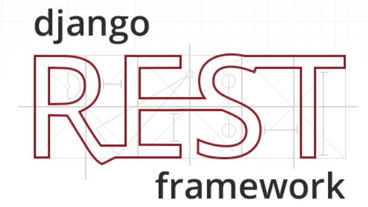

# README: /backend



This readme will give a short introduction on how to set up the provided API for the application to use.

## Before you start

Since the API is a Django Rest Framework, we need to install some dependencies. This guide takes for granted that <i>Python 3.6 or a later version</i> and <i>pip</i> is already downloaded on the system.

If you want to learn more about the Django Rest Framework, [follow this link](https://www.django-rest-framework.org/)

As you can see, a virtual environment <i><b>/env</i></b> is not the root directory for the API code. The root directory for the API code itself is <i><b>/env/shopstopbackend</i></b>. [Click here If you want to learn how to set up a virtual environment in python](https://packaging.python.org/guides/installing-using-pip-and-virtual-environments/)


### Virtual environment and requirements

1. Navigate into the <i><b>/env</i></b> directory and run the command :

```
scripts\activate
```

This should activate the virtual environment so that you do not install all the dependencies globally on your system.You can see that you are inside the virtual environment if you have <b>`(env)`</b> in front of your path such as this: <br>
```
(env) path\to\root\01\backend\env>
```
instead of
```
path\to\root\01\backend\env>
```

If this causes an error, you may need to make your own virtual environment and extract the <i><b>/shopstopbackend</i></b> folder into that directory on your system.


2. Navigate into <i><b>/shopstopbackend</i></b>. 

3. Run the command:
```
pip install -r requirements.txt
```

This command will install all the dependencies that are needed for the API to run correctly. It will extract all of these dependencies from the <i>requirements.txt</i> file. If you want to overwrite this file, you can use the command:<br>
```
pip freeze > requirements.txt
```

If for some reason this did not work, you might have to install all of the requrements manually. To do this, open <i>requirements.txt</i> and for each of the requirements write the command: <br>
```
pip install <name of requirement>
```

The mysqlclient is known for causing errors. Life ain't always easy is it :/ If you are one of the unlucky, don't be sad, we know your pain. We have provided you with a `.whl` file that you will have to install with this command:
```
pip install "path/to/mysqlclient(...).whl"
```

This will install the mysqlclient correctly on your system. In most text editors you can right click the file and select <i><b>"Copy Path"</b></i> to easily get the correct path.

Congratulations! You have successfully downloaded all the dependencies needed to continue.

## Connecting to a database

The most crucial part of the API code is located inside the <i><b>/shopstopbackend/shopstopbackend</b></i> directory. More specifically inside the <i>settings.py</i> file. To connect to a database, scroll down to the databases list. It will look something like this:
```python 
DATABASES = {
    'default': {
    'ENGINE': 'django.db.backends.mysql',
    'NAME':'DBNAME',
    'USER':'USERNAME',
    'PASSWORD': 'DBPASSWORD',
    'HOST':'DBHOST',
    }
}
```

Edit the `NAME`, `USER`, `PASSWORD` and `HOST` fields to correspond to your database. 

Leave the `ENGINE` field as it is.

We will provide you with the SQL for the database structure if you want to create your own clean database to connect to. [The SQL can be found here](../SQL.sql).
You just have to import it into the MySQL workbench.

## How to run the API

When you have connected to a database, you are ready to run the API. This is very easy. You simply make sure that you are in the same directory as the <i>manage.py</i> file and then write the command: 
```python
python manage.py runserver
```

If you have done everything correctly, you should see this line in the terminal:

```python
Starting development server at http://127.0.0.1:8000/
```

You can now open your browser at http://localhost:8000 or http://127.0.0.1:8000 and view your API.

Any edits you make inside the Python code will automatically re-run the command in the terminal, thus updating the API automatically. If an error occurs, it terminates the session. 

Remember to keep the API server running as long as you want it to accept your HTTP requests.